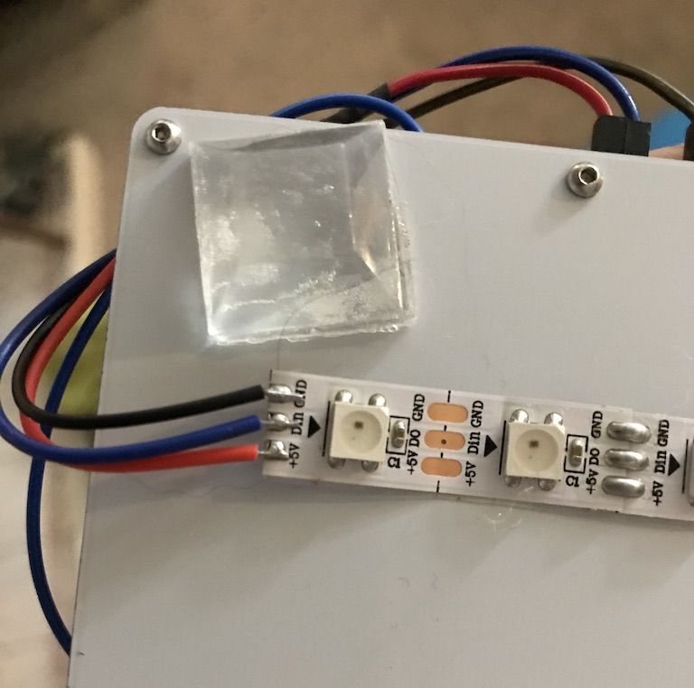

### Instructions on how to install RGB LED Strips as RGB underglow

First, check that you have all required parts:

- 14 RGB LEDs (e.g. from WS2812/ SK6812 LED strips)
- rectangular header connectors (e.g. [PRPC040SBAN-M71RC](https://www.digikey.ca/product-detail/en/sullins-connector-solutions/PRPC040SBAN-M71RC/S1111EC-40-ND/2775294))  
  these need to be broken into 3 pieces, 2x 5 pins and 2x 1 pin
- 4x female header connectors to attach to your LED strips. Later these will be cut in half, we need 7 halves

The connectors are only required if you want to be able to detach the RGB strip, which can be useful if you need to work on the PCB after you've completed soldering.   The below images assume you're using the left side of the keyboard to control your RGB strip.

Please make sure you don't use the resistors; I2C is not yet compatible with RGB underglow. Also make sure you don't have jumpered/soldered the I2C jumper.

---

1. Solder all rectangular connectors onto both halves.

Back of left hand:   
Back of right hand: 

2. Cut female header connectors in half to prepare them to be attached to the LED strips:


3. Wire the header connectors on both RGB strips: black for GND, red for VCC, blue for data


4. on one RGB strip, wire a header connector on the other side of the RGB strip to Do.

5. Attach female and male header connectors: Attach VCC, GND and Di on the left side, as well as Do to the single extra pin.
On the right side, Attach VCC and GND, and Di from the single extra pin.

Back of left hand:   
Back of right hand: 

This should complete the hardware assembly.

6. Update firmware to enable RGB underglow: the  `rules.mk` file must contains the following line:

```
RGBLIGHT_ENABLE = yes
```

To control the RGB underglow see the QMK [feature documentation](https://github.com/qmk/qmk_firmware/blob/master/docs/feature_rgblight.md)
